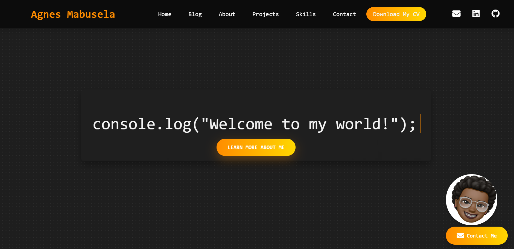
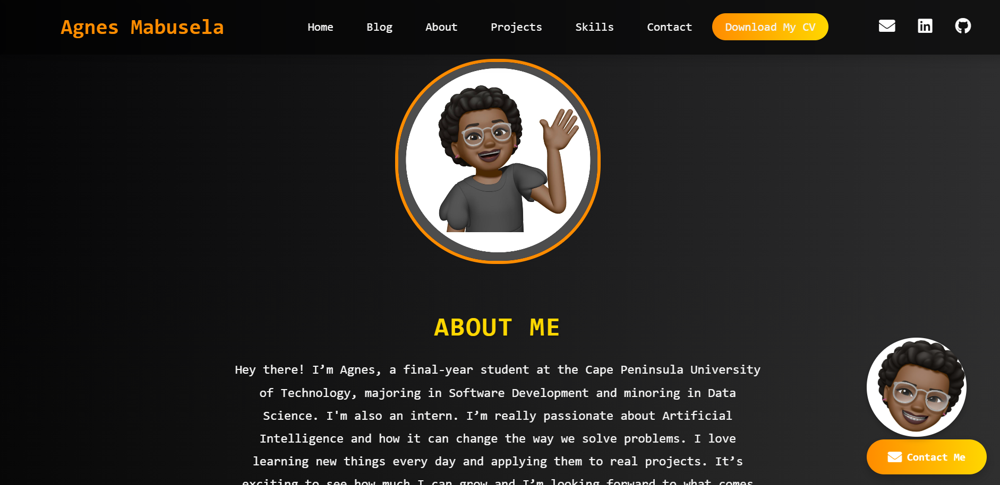
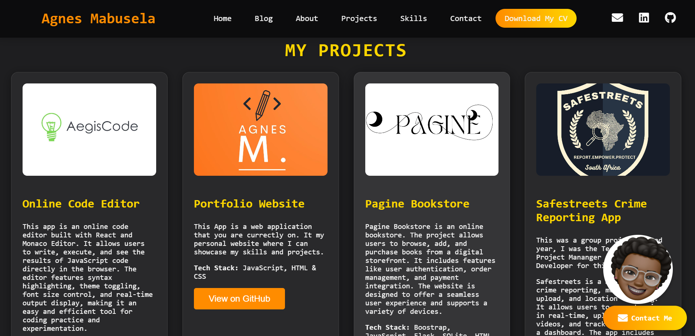
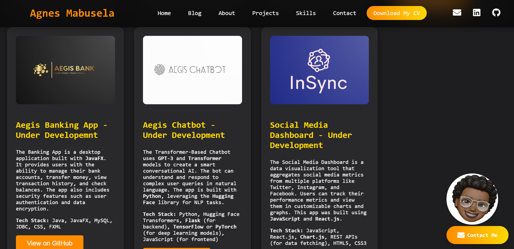
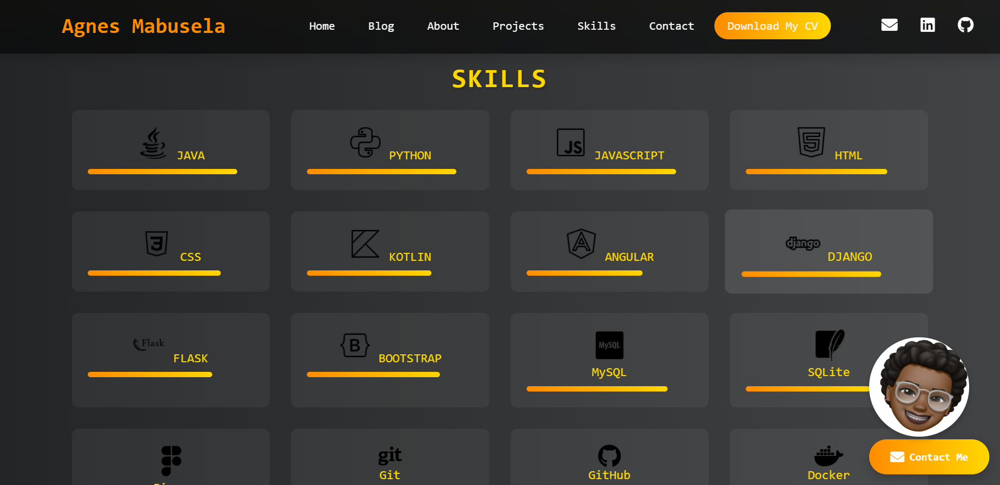
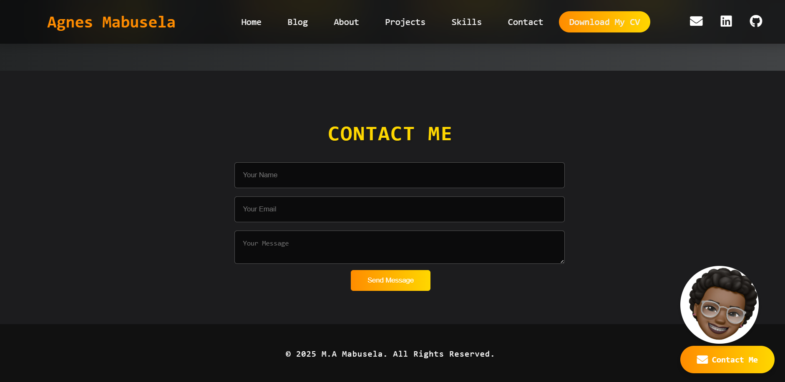

# Personal Portfolio Website
SCREENSHOTS PROVIDED!!!

Welcome to my personal portfolio website! This project is a one-stop platform showcasing who I am, my skills, projects, and blog posts. It’s designed to reflect my journey as a developer and share my work with the world. 🚀

---

## 🌟 Features

- **Home Section**: A visually appealing introduction with an animated typing effect and modern design.
- **About Section**: Learn more about me, my background, and my passion for technology.
- **Projects Section**: Showcases my top projects with descriptions, tech stacks, and links to demos or repositories.
- **Skills Section**: Highlights my technical proficiencies in a concise manner.
- **Blog Section**: A dedicated space to share insights, tutorials, and thoughts on tech, AI, and software development (Coming Soon!).
- **Contact Section**: Provides easy ways to reach me, including an interactive floating contact button.

---

## 🛠️ Tech Stack

- **HTML5**: For structuring content.
- **CSS3**: For styling, animations, and responsiveness.
- **JavaScript**: For interactive elements and dynamic effects.
- **Libraries/Frameworks**:
  - AOS (Animate On Scroll): For smooth scroll animations.
  - FontAwesome: For beautifully designed icons.
- **Hosting**: Deployed on **Netlify**.

---

## 🚀 How to Run Locally

1. **Clone the Repository**:
   ```bash
   git clone https://github.com/your-username/portfolio-website.git
   ```
2. **Navigate to the Project Directory**:
   ```bash
   cd portfolio-website
   ```
3. **Open `index.html` in Your Browser**:
   - Double-click the file.
   - Or use a local server (e.g., Live Server in VS Code) for the best experience.

---

## 📂 Project Structure

```
portfolio-website/
├── index.html         # Main HTML file
├── style.css          # CSS file for styling
├── script.js          # JavaScript for interactivity
├── assets/            # Folder for images, videos, and other assets
│   ├── images/        # Images used across the website
│   ├── icons/         # Custom or downloaded icons
├── README.md          # This file
```

---

## 📸 Screenshots

### Home Page  


### About Me  


### Projects  


### More Projects


### Skills  


### Contact  


### Blog Section (Coming Soon!)  


---

## 🌐 Live Demo

Check out the live version of my portfolio: [https://agnesmabusela.netlify.app/](#)

---

## 🤝 Contributing

I’m always open to suggestions and feedback! If you have ideas to improve the website:

1. Fork the repository.
2. Create a new branch.
3. Submit a pull request with your enhancements.

---

## 📩 Contact Me

Feel free to connect with me via:

- **Email**: agnesmabusela12@gmail.com  
- **LinkedIn**: [Agnes Mabusela](https://www.linkedin.com/in/agnes-mabusela)  
- **GitHub**: [Agnes-99](https://github.com/Agnes-99)

---

## 🖋️ License

This project is licensed under the **MIT License**. Feel free to use, modify, and distribute this project as you see fit.
